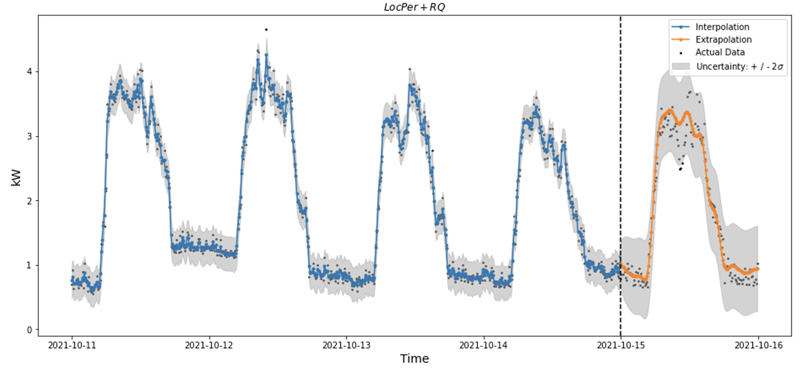
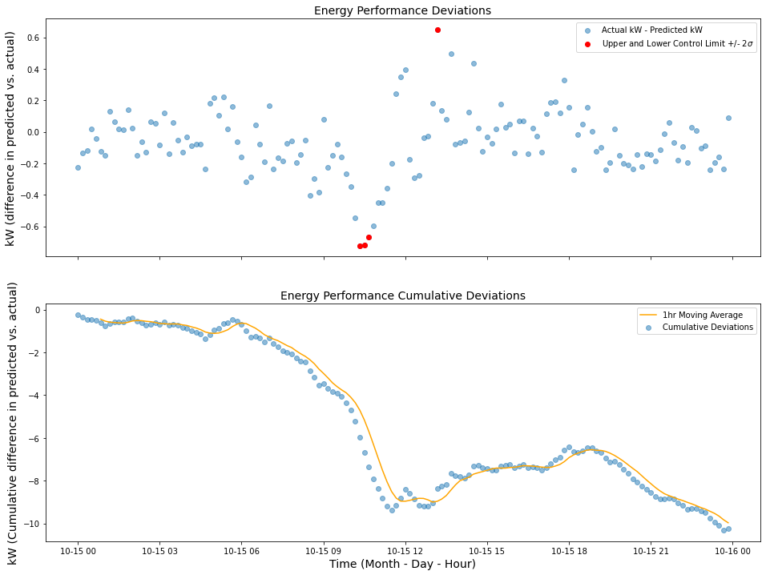
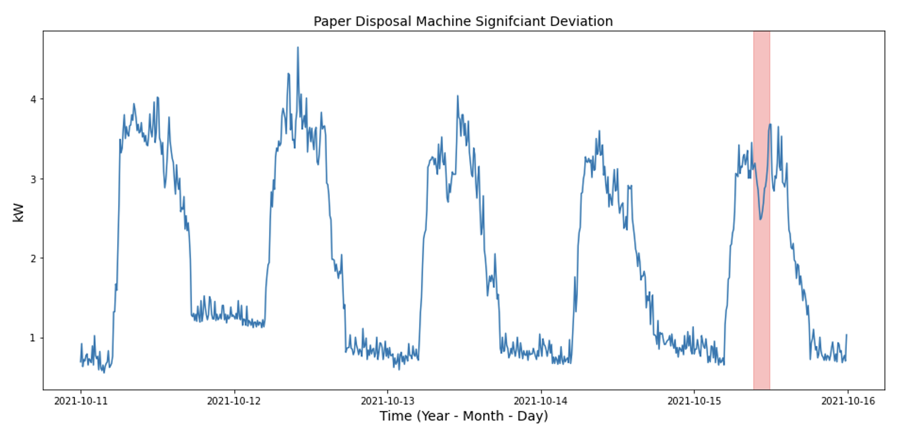

# Energy-Efficiency-Thesis

## Reproduce the results

**Method 1**

*Note: It is advised to create a new environment*

1.) Clone the repo and `cd` into the root directory

2.) Build image

`docker build thesis-model .`

3.) Run the container and model(s)

`docker run -i thesis-model`

**Method 2**

1.) Pull the image from Docker Hub (contact author for access to private Docker Hub )

`docker pull [OPTIONS] NAME[:TAG|@DIGEST]`

### Available Data

Upon building and running the container, you will be asked to enter a machine and the time aggregation you would like to analyze

`Enter machine name:`

`Enter time aggregation (10 or 30):`

Available time sampling is `10` and `30` minutes. The following machines have energy baseline models ready to perform inference (prediction):

- Entsorgung
- Hauptluftung
- Gesamtmessung
- UV EG
- UV OG
- EG

### Returns

After entering a machine and time aggregation, the model will perform one day ahead predictions at the time sampling interval passed. Scoring metrics (MSE, RMSE, MAPE, ACE, and Pinball Loss) are returned for the predictions. In addition, a `pd.DataFrame` will be returned containing the time, actual kW, predicted kW, and upper / lower control limit. 